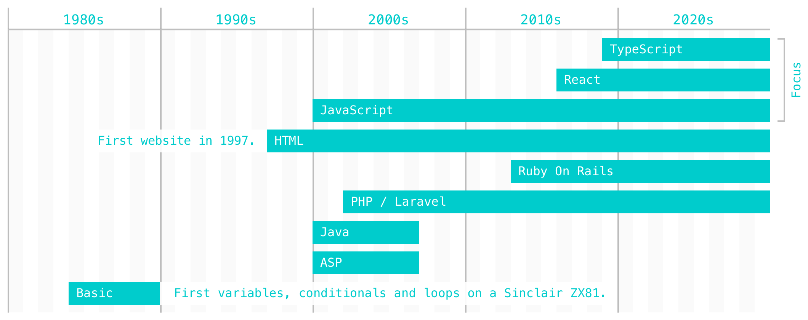

### Hi there, I'm JP. I started programming in the mid-1980s. 👨

- 💻 GitHub Pages: https://jpbarbosa.github.io
- 🔭 I work at [JP7](https://www.jp7.com.br).
- 🌱 I’m currently improving my React skills with TypeScript.
- 👯 I’m looking to collaborate on projects to teach people programming skills.
- 🤔 I’m looking for help to refactor a large legacy codebase. 💪
- 💬 Ask me about how to [set up a basic CRUD app using React with TypeScript](https://github.com/jp7internet/typescript-crud).
- 📫 How to reach me: https://www.linkedin.com/in/joaopedrobarbosa/
- 😄 Pronouns: he/him
- ⚡ Fun fact: I started learning basic 日本語 in 2020. 🇯🇵
