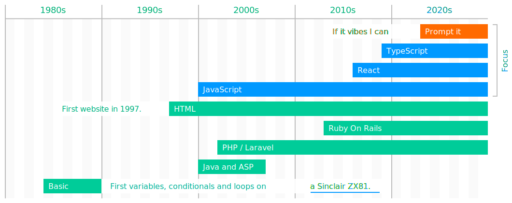

In 2026, peace of mind means updated markdowns for spec-driven development. AI is not the destiny but an everyday tool I bring into software architecture, SaaS development, and prompt engineering. Things are on the right track when complexity becomes simplicity, and code feels modern and maintainable.

Reach me on https://www.linkedin.com/in/joaopedrobarbosa/
