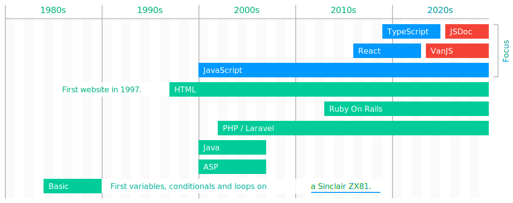

In 2025, peace of mind means using Docker Compose YAML for both development and production. AI is not the destiny but an everyday tool I use with TypeScript, Ruby on Rails, and Laravel. Things are on the right track when complexity becomes simplicity, and code feels modern and maintainable.

Reach me on https://www.linkedin.com/in/joaopedrobarbosa/
